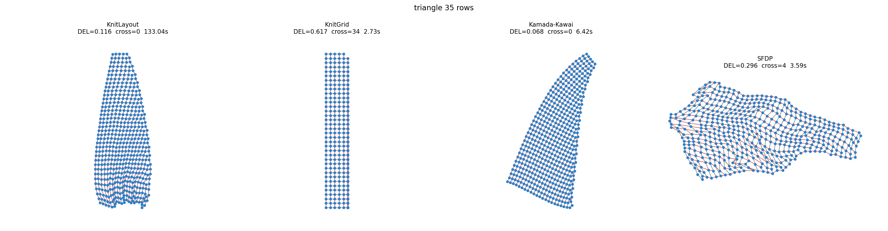
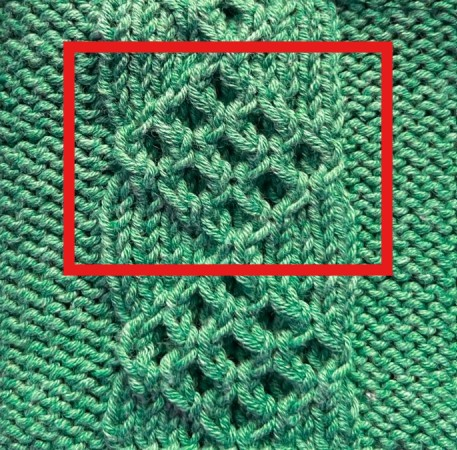
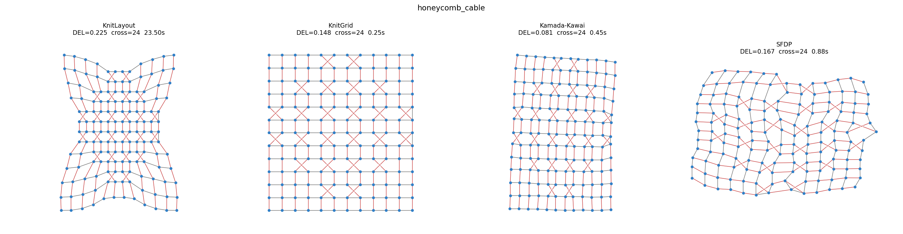

# A Graph Model and a Layout Algorithm for Knitting Patterns

Python re-implementation, Master Seminar project.

> **Kathryn Gray, Brian Bell, Stephen Kobourov.**
> *A Graph Model and a Layout Algorithm for Knitting Patterns.*
> Graph Drawing (GD) 2024 — arXiv:2406.13800.

It implements the paper's two algorithms, its evaluation metrics, and the
competing layout methods, then reproduces the paper's experimental findings
and adds an independent evaluation, including a non-planar (cable) case the
paper's own algorithm does not cover.


*Gray et al.'s own Figure 1: a lace pattern's text instructions (left), its
graph layout (middle), and the resulting knitted swatch (right).*

---

## What it does

**Algorithm 1 - pattern to graph** (`graph_model.py`): a knitting pattern is
converted into a graph.

- cast-on stitches become the first vertices, connected by yarn edges;
- for each following stitch instruction, the stitch dictionary says how many
  loops it consumes and creates — the new vertex gets a **yarn edge** (grey)
  to the previous stitch and a **loop edge** (red) to the stitch(es) below it;
- every edge gets a **pre-specified length** (stitches are taller than wide,
  so loop/column edges are longer than yarn/row edges).

**Algorithm 2 - KnitLayout** (`layout.py`): the graph is drawn in two stages —
a crossing-free initial layout, then safe force-directed steps that pull
edges towards their target lengths while *never* introducing an edge
crossing.

---

## Project layout

```
knitviz/                 the library
├── stitches.py          stitch dictionary (Table 1) + base edge lengths
├── patterns.py          pattern text parser + pattern generators
├── graph_model.py       Algorithm 1 (pattern -> graph) + knittability checks
├── layout.py            Algorithm 2 (KnitLayout: init + safe FDA, 3 forces)
├── baselines.py         KnitGrid (Counts), SFDP (Graphviz), Kamada-Kawai
├── metrics.py           DEL (Eq. 1) and crossing count
└── draw.py              figure rendering
experiments.py           reproduction experiments -> results/
analysis.py              ablations, convergence and graph-model checks
```

---

## Requirements

- Python 3.9+ (developed and tested on Python 3.10)
- `networkx`, `numpy`, `scipy`, `matplotlib` (`pip install -r requirements.txt`)
- **Optional:** [Graphviz](https://graphviz.org/) on `PATH` (provides `sfdp`)
  for the SFDP comparison. If absent, SFDP is skipped automatically.

---

## How to run

```bash
# main reproduction experiments (DEL, crossings, runtime + figures)
python experiments.py --mode quick      # ~1–2 min
python experiments.py --mode full       # paper-scale, several minutes

# supplementary experiments: ablations, convergence, model unit-checks
python analysis.py
```

Outputs are written to `results/`:

- `results.csv`, `results.json`, `results.md` — raw numbers and tables,
- `figures/*.png` — side-by-side layout comparisons.

---

## Results

On class-0 (planar) knitting patterns, KnitLayout achieves the lowest
edge-length error among the crossing-free, scope-correct methods and never
introduces a crossing, reproducing the paper's central claim. KnitGrid is
fastest but crosses edges at increases/decreases; SFDP is fast and smooth but
does not target the prescribed lengths.

DEL (edge length error, lower is better) / crossings, from `experiments.py --mode full`:

| Pattern | Nodes | KnitLayout | KnitGrid | SFDP | Kamada–Kawai |
|---|---:|---|---|---|---|
| stockinette      | 208 | **0.061 / 0** | 0.164 / 0  | 0.269 / 0 | 0.017 / 0 |
| antique_diamonds | 247 | **0.058 / 0** | 0.292 / 12 | 0.259 / 0 | 0.041 / 0 |
| eyelet_lace      | 273 | **0.064 / 0** | 0.265 / 0  | 0.228 / 0 | 0.046 / 0 |
| drop_stitch      | 234 | **0.124 / 0** | 0.205 / 0  | 0.310 / 0 | 0.118 / 0 |
| triangle (×35)   | 504 | **0.116 / 0** | 0.617 / 34 | 0.296 / 4 | 0.068 / 0 |

KnitLayout's edge-length error is 3–8× smaller than KnitGrid and 2–4× smaller
than SFDP, always crossing free; KnitGrid's crossings grow with size and SFDP
starts crossing on the largest graph. Kamada–Kawai reaches a lower DEL on
these *planar* instances but gives no crossing guarantee.

**Reproduction note:** matching the paper's quality requires the
knitting-structure-aware initial layout the authors motivate (§5.1/§7); the
literal NetworkX planar init traps the hard-constraint step at DEL ≈ 0.4–0.8.
Both inits are in the code (`knitting_layout`, `planar_layout`).



*Triangle shawl at 35 rows (504 nodes). KnitLayout keeps the tapered
triangular shape crossing-free; KnitGrid's rigid grid placement collapses it
into a rectangle with 34 crossings; Kamada–Kawai reaches a lower DEL with no
crossing guarantee; SFDP visibly self-intersects (4 crossings).*

---

## Supported stitches (Table 1)

| Token | Name | nodes added | loops below | planar |
|---|---|---:|---:|:--:|
| `k`/`p` | knit / purl | 1 | 1 | ✓ |
| `yo`, `m1` | yarn over / make one (increase) | 1 | 0 | ✓ |
| `kfb` | knit front & back (increase) | 2 | 1 | ✓ |
| `k2tog`, `ssk` | decreases | 1 | 2 | ✓ |
| `sl1-k2-psso` | central double decrease | 1 | 3 | ✓ |
| `drop` | dropped stitch (long yarn float) | 1 | 1 | ✓ |
| `cNb`, `cNf` (`N ≥ 1`) | cables (complexity class 1, non-planar) | 2N | 2N | ✗ |

Cables are non-planar class-1 patterns. `KnitLayout` preserves their declared
crossings, front/back order, and the row in which each cable instruction
creates them, while rejecting every unintended crossing — validated below on
a real sourced cable chart.

---

## Addressing the paper's open question on non-planar layouts

The paper's own future-work section closes with:

> "Another interesting question is the development of natural non-planar
> layouts which keep edge crossings in the location in which they would be
> naturally introduced during knitting."

The paper's algorithm only targets class-0 (planar) patterns; it does not
implement this. This repo does, for the cable subset of class 1:

- **`graph_model.py`** records a *crossing signature* while building the graph:
  for every cable instruction, which pair of edges must cross, which strand
  is in front, and the row the cable is worked in — i.e. where the crossing
  is naturally introduced.
- **`cable_layout`** (`layout.py`) places stitches at their natural
  `(col, row)` position, so the signature's crossings already appear at the
  correct row before any optimization.
- **`knit_layout`**'s safe-move check (`move_is_safe`) rejects any node
  movement that would change which edges cross, so the signature holds after
  every one of the 400 optimization iterations, not just at the end.



*The sourced Honeycomb Cable pattern (highlighted panel), knit in stockinette
with a diamond lattice of cable crossings — the real chart the graph model
and layout below are validated against.*

Validated on the [Honeycomb Cable chart](https://aabharcreations.com/honeycomb-cable-knitting-stitch-pattern-tutorial/)
(156 nodes, 289 edges, 24 required crossings): KnitLayout reaches
`(missing, unexpected, misplaced) = (0, 0, 0)` — every required crossing is
present, nothing extra, all at the declared row. KnitGrid, Kamada–Kawai, and
SFDP happen to match this too on this one instance (its crossings are small,
locally-forced stitch swaps), but none of them has a mechanism enforcing it —
KnitLayout is the only one that holds by construction rather than by luck of
the instance. This is a single sourced pattern, not a general result; it
shows the mechanism works, not that it generalizes to arbitrary cable charts.



*Honeycomb Cable panel (156 nodes). Red edges crossing in an X mark the 24
cable crossings; all four methods realize them correctly here, but only
KnitLayout's safe-move check enforces that by construction, as described
above.*
